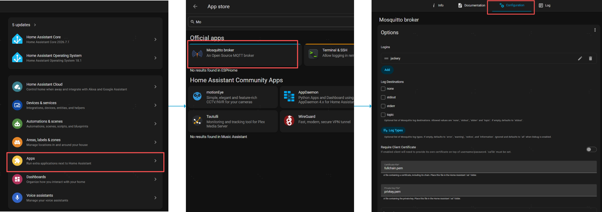
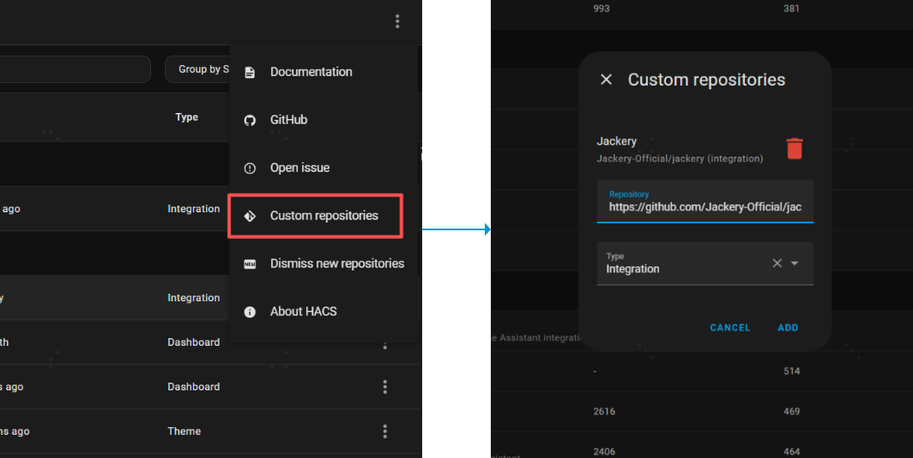
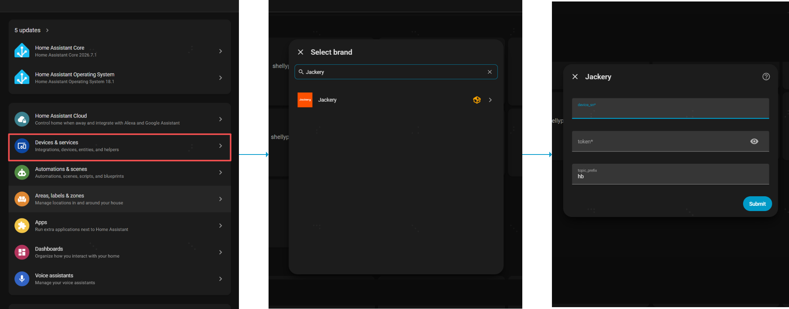

# Jackery – SolarVault3 Series Home Assistant Custom Integration

This official Jackery custom integration for Home Assistant receives monitoring data from Jackery SolarVault3 Series energy-storage systems via MQTT and creates the corresponding sensor entities.

## 1. Features

The integration uses the **Coordinator Pattern**. Each SolarVault3 host has its own `JackeryDataCoordinator` instance, which centrally manages MQTT subscriptions and data requests for that host. Tasks for different hosts are isolated and do not affect one another.

> **Multiple-host support:** The integration supports an unlimited number of instances. Repeat the configuration process to add multiple SolarVault3 hosts. Each host appears in Home Assistant as an individual device; any connected Smart CTs and Smart Plugs appear as child devices.

### 1.1 Entity List

The integration provides comprehensive sensor data and control capabilities, including primary-device controls, operating status, real-time power, energy statistics, and real-time power and energy statistics for child devices.

For details, see [SolarVault 3 Series HA Entity List](custom_components/jackery/HA%20Entity%20List.md).

### 1.2 Child Device Information

- **Smart Plug:** Load power, cumulative energy consumption, and an on/off switch (up to 10 per host). When `commMode=1` (local), the plug can be controlled through MQTT. When `commMode=2` (cloud platform), Home Assistant rejects control commands and prompts you to use the app.
- **Smart CT:** Real-time power, cumulative forward (imported) energy (`Forward Energy`), and cumulative reverse (exported) energy (`Reverse Energy`) (up to one per host).
- If child-device data is no longer present in host MQTT messages, the corresponding entities are marked `Unavailable`. They are restored automatically when the data reappears.

## 2. Prerequisites

Before the Jackery integration can receive any data, **both of the following requirements must be met**:

### Requirement 1: An MQTT broker/server is configured and accessible

⚠️ **Important:** This integration depends on Home Assistant's MQTT integration. Configure MQTT before installing Jackery. The following example uses Mosquitto:

1. In Home Assistant, go to **Settings** → **Apps** → **Install app**.
2. Search for and install **Mosquitto broker**.
3. Configure the MQTT broker connection details:
   - **Broker:** The MQTT broker address, for example `localhost`, `core-mosquitto`, or an IP address.
   - **Port:** The port number (default: `1883`).
   - **Username/Password:** Enter credentials if authentication is required.



### Requirement 2: MQTT settings have been configured for the device in the Jackery app

- Sign in to the Jackery app, add the device, and complete its initial setup.
- In the Jackery app, go to **Device Details** → **Settings** → **MQTT** to open the configuration page.
- On the MQTT configuration page, enter and enable your **MQTT server IP address, port, username, and password**.
- A token is generated automatically. Enter it on the device-authentication screen of the Jackery integration in Home Assistant.
- **⚠️ App version requirement:** This entry point is available only in Jackery app versions later than **2.0.0**.


## 3. Installation

### 3.1 Install through HACS (recommended)

1. Ensure that [HACS](https://hacs.xyz/) is installed.
2. Go to **HACS** → click the menu in the upper-right corner → **Custom repositories**.
3. Add the repository URL (`https://github.com/Jackery-Official/jackery`) and select the **Integration** category.
4. Click **Add**.



### 3.2 Configure the Integration

1. In Home Assistant, go to **Settings** → **Devices & services**.
2. Click **Add integration** in the lower-right corner.
3. Search for `Jackery`.
4. **Device SN:** Enter the serial number of the DIY3 host (required; it uniquely identifies the integration instance).
5. **Token:** Enter the device token (required; it is obtained from the Jackery app and provisioned to the device. Commands include this token, which the device uses for authentication and authorization).
6. **MQTT Topic Prefix:** Enter the MQTT topic prefix (optional; default: `hb`).
7. Click **Submit** to complete the configuration.

> **Multiple hosts:** Repeat the preceding steps to add multiple DIY3 hosts. Enter the corresponding SN and token for each host. The same SN cannot be added more than once.

An error message is displayed if the MQTT integration has not been configured or is unavailable.



### 3.3 Token Reauthentication

Because a device does not return a message when it rejects a token, the integration uses a heuristic: **after configuration, it polls continuously every 5 seconds. If no message from the local host is received within 120 seconds** (which most likely indicates an invalid token or incorrect SN), **Reauthentication Required** is displayed automatically on the integration page. After you enter a valid token, the integration reloads automatically.

## 4. Architecture

### 4.1 Coordinator Pattern

Each host uses a `JackeryDataCoordinator` instance to centrally manage data retrieval for that host:

- **One coordinator per host:** Subscription and polling tasks for each host are independent and do not affect one another (task isolation).
- **Centralized data requests:** A query request is sent every **5 seconds** (Phase 2 requirement).
- **Automatic data distribution:** After receiving a response, the coordinator automatically distributes data to the appropriate entities according to JSON fields.
- **Local-host message filtering:** The coordinator processes only messages belonging to its `device_sn`, preventing data from different hosts from being mixed.

### 4.2 Data Flow

1. **Subscription phase:**
   - The coordinator subscribes to the host-specific topics `hb/device/{sn}/status` and `hb/device/{sn}/event`.
   - Messages from other hosts are ignored.

2. **Polling phase** (every 5 seconds):
   - Sends a host status query to `hb/device/{sn}/action` (`type: 25`, single-device level).
   - Sends a full grid-connected system query (`type: 105`, `body: null`); the device responds with full system attributes using `type: 106`.
   - Sends a child-device query (`type: 100`; `devType=2` retrieves the CT, meter-reading head, and meter at the same time; the device reports each item separately with `type: 101`).

3. **Data processing:**
   - Receives JSON data from the `status` and `event` topics and merges it into the cache.
   - Parses fields such as `batSoc`, `pvPw`, `stat`, `softver`, and `deviceType`.
   - Explicitly handles full system reports of `type: 106` (`workModel` → `workMode`, including grid-connected, CT, and meter-reader status).
   - Explicitly handles incremental reports of `type: 107` (`soc` → `batSoc`; `workMode` → the `work_mode` sensor).
   - Supports flat `status` messages (when no `type`/`body` wrapper is present, power fields are extracted directly).
   - Calculates energy flows according to the app formulas (grid, household load, AC socket, and net battery power).
   - Converts data units, such as temperature × 0.1 and energy × 0.01.
   - Updates all related entity states and refreshes the device model and firmware version as needed.

4. **Offline and exception handling:**
   - If no message is received from a host for more than **60 seconds**, all entities for that host are marked `Unavailable`; they are automatically marked `Available` when communication resumes.
   - If a child device is absent from messages for more than 60 seconds, its corresponding entities are marked `Unavailable` (not deleted) and are restored automatically when it reappears.
   - If JSON parsing fails, the last valid cache is retained and a warning is logged.

## 5. MQTT Topic Format

The integration uses the following MQTT topic pattern (assuming the default prefix `hb`):

- **Status/data topic:** `hb/device/{sn}/status`
  - The device publishes real-time status data to this topic.
  - Example payload:
    ```json
    {
      "batSoc": 85,
      "batInPw": 0,
      "batOutPw": 150,
      "cellTemp": 255,
      "pvPw": 400,
      ...
    }
    ```

- **Control/query topic:** `hb/device/{sn}/action`
  - The integration sends query commands to this topic.
  - Example payload:
    ```json
    {
      "type": 25,
      "eventId": 0,
      "messageId": 1234,
      "ts": 1700000000,
      "token": "YOUR_TOKEN",
      "body": null
    }
    ```

- **Incremental-report topic:** `hb/device/{sn}/event` (`type: 107`)
  - The device proactively publishes incremental attributes, such as SOC and operating mode.
  - Example payload:
    ```json
    {
      "type": 107,
      "eventId": 0,
      "messageId": 3984,
      "ts": 1713337422,
      "deviceType": 3,
      "body": {
        "soc": 12,
        "workMode": 3
      }
    }
    ```

### Energy Flow Calculation Formulas

| Metric | Formula | Primary MQTT Fields |
|---|---|---|
| PV | `pvPw` | `pvPw` |
| Grid-connected port | `gridInPw - gridOutPw` (fallback: `inOngridPw - outOngridPw`) | `gridInPw`, `gridOutPw`, `inOngridPw`, `outOngridPw` |
| Grid | CT takes priority; without a CT, `inGridSidePw - outGridSidePw` | `TphasePw`, `TnphasePw`, `inGridSidePw`, `outGridSidePw` |
| AC Socket | `swEpsInPw > 0 ? swEpsInPw : swEpsOutPw` | `swEpsInPw`, `swEpsOutPw` |
| Net battery power | `pv + ac + ong` | Calculated field: `calc_batt_net_power` |
| Household load | `grid - ong` (including the CT exception branch) | Calculated field: `calc_home_power` |

## 6. View Sensors

After configuration, you can view the sensors in the following locations:

- **Settings** → **Devices & services** → **Jackery** → select the applicable host device to view all its entities.
- **Developer Tools** → **States** → search for `jackery` or the sensor name.
- In a multiple-host setup, entity IDs include the host identifier, for example `sensor.jackery_<sn>_battery_soc`. Replace the IDs in the examples below with your actual entity IDs.
- Each sensor includes the following attributes:
  - `device_sn`: Device serial number.
  - `raw_key`: Original JSON field name.

## 7. Use in Lovelace

The default device page presents more than 40 entities in a flat layout. It provides dense information but limited hierarchy, so a custom dashboard is recommended.

### 7.1 Complete Visual Dashboard (Recommended)

1. Install **Mushroom Cards** and **Power Flow Card Plus** through HACS.
2. Follow [docs/lovelace_dashboard_setup.md](../../docs/lovelace_dashboard_setup.md) to create the **Jackery Energy** dashboard.
3. Use [docs/lovelace_dashboard_jackery.yaml](../../docs/lovelace_dashboard_jackery.yaml) as the base configuration.
4. For entity ID naming rules, see [docs/entity_id_reference.md](../../docs/entity_id_reference.md).

Dashboard layout: status chips at the top → energy flow diagram → battery/PV/grid metrics → controls → collapsible detailed data.

### 7.2 Energy Flow Card Only

The project-root file [energy_flow_card_config.yaml](../../energy_flow_card_config.yaml) provides a single-card configuration. Replace the SN in each entity ID with the actual value, for example `sensor.jackery_hs2c12600262hh4_solar_power`:

```yaml
type: custom:power-flow-card-plus
entities:
  solar:
    entity: sensor.jackery_{sn}_solar_power
  grid:
    entity: sensor.jackery_{sn}_grid_net_power
    display_state: two_way
  battery:
    entity:
      consumption: sensor.jackery_{sn}_calc_battery_charge_power
      production: sensor.jackery_{sn}_calc_battery_discharge_power
    state_of_charge: sensor.jackery_{sn}_battery_soc
    display_state: two_way
  home:
    entity: sensor.jackery_{sn}_home_power
```

## 8. Troubleshooting

### 8.1 Common Issues

1. **The device cannot be discovered:**
   - Confirm that the device is connected to the MQTT broker.
   - Use an MQTT tool, such as MQTT Explorer, to monitor `hb/#` and confirm that the device is publishing messages.
   - Confirm that the configured **Topic Prefix** matches the prefix actually used by the device (default: `hb`).

2. **The device SN is present, but data is not updating:**
   - Check that the token is correct.
   - Check whether the log contains `Sent poll request` entries.
   - Confirm that the device responds to requests with `type: 25`.

### 8.2 Enable Debug Logging

Add the following to `configuration.yaml`:

```yaml
logger:
  default: info
  logs:
    custom_components.jackery: debug
```

## 9. License

MIT License
