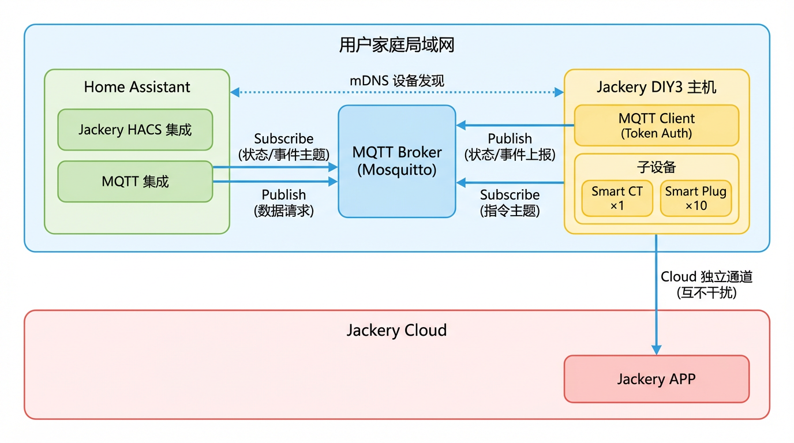
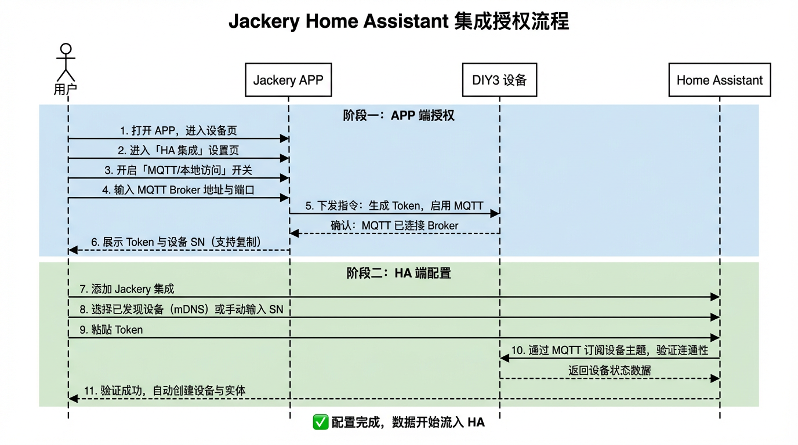
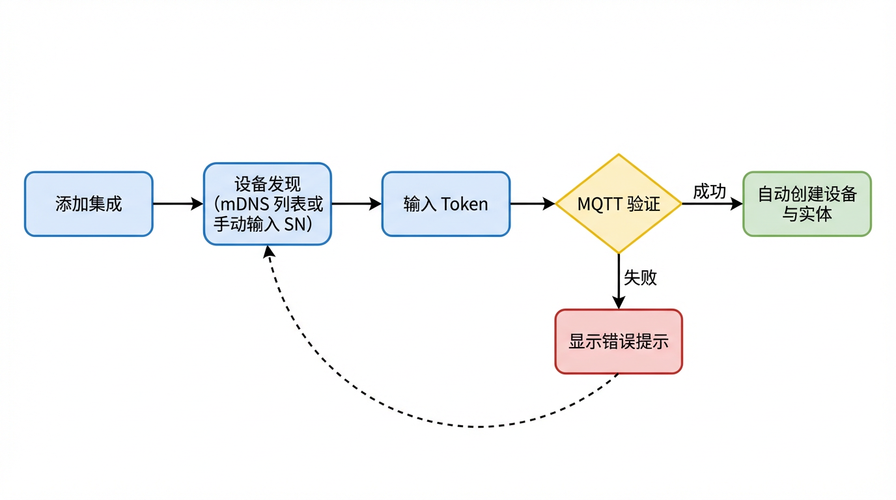
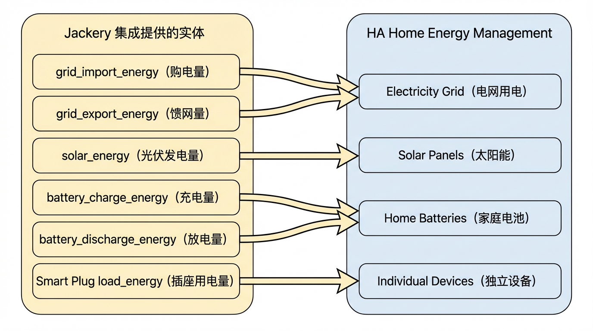

# Jackery DIY3 系列 Home Assistant 集成插件 (HACS) 产品需求文档

---

## 文档版本历史

| 版本 | 日期 | 作者 | 变更说明 |
|------|------|------|----------|
| 1.0 | 2025-03-04 | 黄国庆 | 初稿：完整功能定义、架构设计、实体清单 |

---

## 1. 项目概述与用户价值

### 1.1 项目背景

Jackery（华宝新能）最新一代户用储能产品 **DIY3** 面向全球市场。为满足极客用户（Geek User）对 **数据主权** 和 **本地化控制** 的强烈诉求，需开发一款基于 Home Assistant Community Store (HACS) 分发的自定义集成插件，将 DIY3 主机及其配套智能配件（Smart CT、Smart Plug）无缝接入 Home Assistant 生态。

### 1.2 目标用户

| 用户画像 | 描述 |
|----------|------|
| 核心用户 | 拥有 Jackery DIY3 储能系统、同时是 Home Assistant 活跃用户的技术爱好者 |
| 典型特征 | 重视数据隐私、偏好本地优先架构、熟悉 HACS 安装流程、有能力自建 HA 实例 |
| 地域分布 | 欧美及亚太市场的独立屋/别墅用户为主 |

### 1.3 用户价值

#### 数据主权 (Data Sovereignty)

- 所有能源数据通过 **局域网 MQTT** 获取，设备连接用户本地 MQTT Broker，不依赖云端中转。
- 数据在用户自有 HA 实例内存储与处理，完全由用户掌控。
- 即使互联网中断，本地数据采集与展示不受影响。

#### 无缝集成 (Seamless Integration)

- 一键通过 HACS 安装，标准 Config Flow 配置，无需编写 YAML。
- 支持 mDNS 设备自动发现，降低手动输入 IP 的门槛。
- 传感器实体完全适配 HA 原生 **Energy Dashboard**，用户可直接查看太阳能发电、电池充放、电网交互等能源数据。

#### 与云端共存 (Cloud Coexistence)

- 本地集成**不影响**设备与 Jackery Cloud 的连接。
- 用户可同时使用 Jackery APP（云端）和 HA（本地）查看设备数据，两条通道独立并存、互不干扰。

---

## 2. 系统架构

### 2.1 整体架构描述



### 2.2 前置条件（用户侧）

Jackery 集成采用 **MQTT 协议** 通信，设备与 HA 之间需要一个 **本地 MQTT Broker** 作为消息中转。用户需在使用前完成以下准备：

| 序号 | 前置条件 | 说明 | 责任方 |
|------|----------|------|--------|
| ① | **部署 MQTT Broker** | 用户需在局域网内运行一个 MQTT Broker。推荐使用 Home Assistant 官方的 **Mosquitto broker Add-on**（在 HA 的「设置 → 加载项 → 加载项商店」中安装），也可使用任何标准 MQTT Broker（如 EMQX、HiveMQ 等） | 用户 |
| ② | **配置 HA 内置 MQTT 集成** | 在 HA 的「设置 → 设备与服务 → 添加集成」中搜索并配置 **MQTT** 集成，填写 Broker 地址、端口、用户名/密码（如有），确保 HA 成功连接到 Broker | 用户 |
| ③ | **在 Jackery APP 中配置 MQTT 地址** | 在 APP 的设备设置中开启「本地访问 / HA 集成」，输入步骤 ① 中 Broker 的 **IP 地址与端口**，使设备连接到同一个 Broker | 用户 |
| ④ | **确保网络互通** | HA 运行设备、MQTT Broker、Jackery DIY3 主机三者需处于 **同一局域网**（或网络可达） | 用户 |

> **为什么需要用户自建 MQTT Broker？**
>
> Jackery 集成采用 **Local First** 架构，所有数据在用户本地网络内流转，不经过任何云端服务。MQTT Broker 是实现本地发布/订阅通信的核心组件。Home Assistant 官方提供了开箱即用的 Mosquitto Add-on，安装仅需点击几下，绝大多数用户无需额外配置。

### 2.3 架构要点

| 要点 | 说明 |
|------|------|
| **连接方式** | 设备与 HA 通过局域网内的 MQTT Broker 通信，Token 鉴权 |
| **MQTT Broker** | 用户自行部署（推荐 HA Mosquitto Add-on），Jackery 集成依赖 HA 内置 MQTT 集成与 Broker 通信 |
| **设备发现** | 支持 mDNS 自动发现局域网内的 DIY3 设备，同时支持手动输入设备 SN |
| **数据获取** | 设备通过 MQTT 主动上报状态与事件数据；HA 集成定时通过 MQTT 发送数据请求指令（5 秒间隔），获取主机及全部子设备数据 |
| **云端共存** | DIY3 主机同时保持与 Jackery Cloud 的独立连接，APP 功能不受影响 |
| **子设备拓扑** | Smart CT 和 Smart Plug 通过主机内部协议连接，HA 仅与主机通信；主机负责聚合子设备数据，统一通过 MQTT 上报 |
| **安全策略** | 本版本严格只读，仅提供 Sensor 与 Binary Sensor，不包含任何控制类实体 |

### 2.4 授权流程

> **前提**：用户已完成 §2.2 中的前置条件（MQTT Broker 已部署、HA MQTT 集成已配置）。

以下描述用户从零开始完成设备授权与集成配置的完整流程：



**授权流程分步说明：**

| 步骤 | 执行方 | 动作 |
|------|--------|------|
| 1–3 | 用户 → APP | 在 Jackery APP 中找到目标设备，进入「Home Assistant / 本地访问」设置页，打开 MQTT/本地访问开关 |
| 4 | 用户 → APP | 在 APP 中输入本地 MQTT Broker 地址与端口（即 HA 所在机器的 IP 和 Mosquitto 端口） |
| 5–6 | APP → 设备 | APP 向设备下发指令，生成一次性 Local Access Token，设备启用 MQTT 功能并连接用户本地 Broker |
| 7 | APP → 用户 | APP 界面展示 Token 与设备 SN（支持复制） |
| 8–10 | 用户 → HA | 在 HA 中添加 Jackery 集成，选择已发现设备（或手动输入设备 SN），粘贴 Token |
| 11 | HA → 设备 | HA 通过 MQTT 订阅设备主题，验证连通性与 Token 鉴权 |
| 12 | HA | 验证通过后自动识别设备型号，创建 Device 及全部 Sensor 实体 |

> **注意**：当前版本 Token 无过期机制，也不支持续期。后续版本将考虑 Token 生命周期管理（见第 9 节路线图）。

---

## 3. 核心约束

以下约束在本版本中 **必须严格遵守**，不可协商。

| 编号 | 约束 | 说明 |
|------|------|------|
| C-1 | **HACS 分发** | 以 Custom Component 形式通过 HACS 安装，不进入 HA 官方核心库 |
| C-2 | **Local First** | 通过局域网本地 MQTT Broker 通信，确保低延迟与断网可用 |
| C-3 | **云端共存** | 本地连接不影响设备与 Jackery Cloud 的通信，APP 功能完整 |
| C-4 | **严格只读** | 本版本 **禁止任何控制操作**。不得包含 Switch、Number、Button 等可写实体，仅提供 Sensor 与 Binary Sensor |
| C-5 | **不暴露 EMS** | 能源管理策略（充电优先级、市电互补等）由设备端黑盒处理，HA 仅展示最终状态 |
| C-6 | **Token 鉴权** | 使用 Jackery APP 生成的一次性 Token 进行身份验证 |

---

## 4. 设备支持范围

### 4.1 支持设备列表

| 设备 | 类型 | 数量限制 | 连接方式 |
|------|------|----------|----------|
| **DIY3 主机** | 储能主机 | 每条集成配置对应 1 台主机；同一 HA 支持添加多台 | 通过局域网 MQTT Broker 通信 |
| **Smart CT** | 智能互感器 | 每台主机最多 1 台 | 通过主机内部协议连接，数据由主机聚合上报 |
| **Smart Plug** | 智能插座 | 每台主机最多 10 个 | 通过主机内部协议连接，数据由主机聚合上报 |

### 4.2 Smart CT 规格

| 特性 | 说明 |
|------|------|
| 电气类型 | 支持单相与三相 |
| 上报数据 | 各相电压 (V)、电流 (A)、有功功率 (W)；总有功功率 (W)；能量 (kWh) |
| 典型用途 | 安装于家庭电表侧，监测家庭总负载与电网交互 |

### 4.3 Smart Plug 规格

| 特性 | 说明 |
|------|------|
| 上报数据 | 实时功率 (W)、累计能量 (kWh)、开关状态（只读展示） |
| 数量 | 单台主机最多配对 10 个 |
| 注意 | HA 中 **不可控制** 插座开关，遵循只读原则 |

---

## 5. 详细功能清单

### 5.1 配置流程 (Config Flow)

#### 5.1.1 流程设计



#### 5.1.2 Config Flow 步骤

| 步骤 | 名称 | 说明 |
|------|------|------|
| Step 1 | 设备选择 | 展示通过 mDNS 发现的 DIY3 设备列表（显示设备名称 + SN），同时提供「手动输入设备 SN」选项 |
| Step 2 | Token 输入 | 用户粘贴从 Jackery APP 获取的 Local Access Token，可选填 MQTT 主题前缀（默认 `hb`） |
| Step 3 | 连接验证 | 集成通过 MQTT 订阅设备主题，验证连通性与 Token 鉴权；失败时显示明确错误信息（见 5.1.3） |
| Step 4 | 设备创建 | 验证成功后自动识别设备型号及已连接的子设备（CT、Plug），创建 Device 与全部 Sensor 实体 |

#### 5.1.3 错误处理

| 错误场景 | 错误码 | 用户提示文案 |
|----------|--------|-------------|
| MQTT 不可用或设备不可达 | `cannot_connect` | "无法连接到设备，请检查：1) MQTT 集成已配置并连接到 Broker；2) 设备已在 APP 中开启本地访问并连接到同一 Broker" |
| Token 无效 | `invalid_auth` | "Token 验证失败，请检查 Token 是否正确。可在 Jackery APP 中重新生成" |
| 设备已被添加 | `already_configured` | "该设备已添加到 Home Assistant" |
| 设备不支持 | `unsupported_device` | "该设备型号暂不支持，请确认固件已更新至最新版本" |
| 设备未启用本地访问 | `local_access_disabled` | "设备的本地访问功能未开启，请在 Jackery APP 中开启" |

#### 5.1.4 多设备支持

- **不限制实例数量**：用户可重复执行配置流程添加多台 DIY3 主机。
- 每台主机为独立的 HA Device，其下挂载的 CT 和 Plug 为子设备。
- 各主机使用独立的 MQTT 主题订阅与数据请求任务，互不影响。

### 5.2 实体映射 (Entity Mapping)

#### 5.2.1 Entity ID 命名规范

```
sensor.jackery_{device_sn}_{entity_key}
binary_sensor.jackery_{device_sn}_{entity_key}
```

- `device_sn`：设备序列号，自动从 MQTT 消息中获取，全小写，特殊字符替换为下划线。
- `entity_key`：实体标识，采用 `snake_case`，与下方表格中的 Key 列对应。
- 子设备 Entity ID 格式：`sensor.jackery_{sub_device_sn}_{entity_key}`

**示例**：

```
sensor.jackery_diy3a12345_battery_soc
sensor.jackery_diy3a12345_solar_power
sensor.jackery_ct00001_grid_import_power
sensor.jackery_plug00001_load_power
binary_sensor.jackery_diy3a12345_online
```

#### 5.2.2 DIY3 主机实体

DIY3 主机提供以下四类传感器，覆盖实时监控与长期统计需求：

- **实时功率**：光伏总输入及分路功率、电池充/放电功率、市电购电/馈网功率、EPS 离网输出功率、家庭用电功率（计算值）。
- **电池状态**：SOC（剩余电量百分比）、SOH（健康度）、电池温度、已连接电池包数量。
- **能量统计**：光伏累计发电量、电池累计充/放电量、累计购电量、累计馈网电量、EPS 累计输出电量。所有能量传感器均适配 HA **Energy Dashboard**。
- **运行状态**：在线/离线状态（Binary Sensor）、当前错误码及可读描述。

#### 5.2.3 Smart CT 实体

Smart CT 提供电网侧的电气监测数据：

- **功率**：电网总有功功率，以及各相（A/B/C）有功功率。
- **电压与电流**：各相电压 (V)、电流 (A)。
- **能量统计**：累计正向（购电）电量、累计反向（馈网）电量，适配 Energy Dashboard。

> 单相配置时仅创建 A 相实体；三相配置时自动创建 A/B/C 三相实体，由设备 API 返回的 CT 类型决定。

#### 5.2.4 Smart Plug 实体

Smart Plug 提供单一负载的用电监测：

- **实时功率**：插座负载功率 (W)。
- **能量统计**：插座累计用电量 (kWh)，适配 Energy Dashboard。
- **开关状态**：以 Binary Sensor 只读展示当前开关状态（开/关），用户 **不可** 在 HA 中操控。

#### 5.2.5 HA Device 信息

- 每个设备在 HA 中注册为独立 Device，以序列号 (SN) 唯一标识。
- 设备显示名称格式：`Jackery {型号} {SN 后 4 位}`（如 "Jackery DIY3 2345"）。
- Smart CT 与 Smart Plug 通过 `via_device` 关联到所属 DIY3 主机，形成设备树。

#### 5.2.6 错误码

- 设备端上报数字错误码，集成内置映射表将其翻译为用户可读的描述文案。
- 错误码分为 Warning（警告）与 Error（故障）两个级别，涵盖电池异常、光伏异常、电网异常、逆变器异常、子设备通讯丢失等类别。
- 未识别的错误码统一展示为 "Unknown Error ({code})"。

> 详细的实体字段定义（含 Key、单位、device_class、state_class 等）与错误码映射表见技术设计文档。

---

## 6. UI/UX 交互说明

### 6.1 设备页面

添加成功后，在 HA **设置 → 设备与服务 → Jackery** 下可看到：

- **设备列表**：每台 DIY3 主机为一个独立设备，其下关联的 CT 和 Plug 以子设备形式展示。
- **设备详情**：显示设备型号、SN、固件版本（如有）、在线状态。
- **实体列表**：该设备下的全部 Sensor 与 Binary Sensor。

### 6.2 Home Energy Management 适配

HA 内置的 [Home Energy Management](https://www.home-assistant.io/docs/energy/) 是 Jackery 集成的核心展示场景。该模块支持电网、太阳能、电池、独立设备四大能源维度，Jackery 集成需 **全面适配** 以下各项。

#### 6.2.1 适配总览



#### 6.2.2 Electricity Grid（电网用电）

HA Energy Dashboard 的电网模块需要区分 **从电网购入的电量** 与 **向电网馈出的电量**。

| Dashboard 配置项 | 对应 Jackery 实体 | 数据来源 | 要求 |
|-----------------|------------------|----------|------|
| Grid consumption (购电) | `sensor.jackery_{sn}_grid_import_energy` | DIY3 主机上报 或 Smart CT 正向电量 | `device_class: energy`, `state_class: total_increasing`, 单位 kWh |
| Return to grid (馈网) | `sensor.jackery_{sn}_grid_export_energy` | DIY3 主机上报 或 Smart CT 反向电量 | 同上 |

> **Smart CT 优先**：当 Smart CT 已连接时，建议用户优先使用 CT 的 `grid_import_energy` / `grid_export_energy`，因为 CT 直接安装在电表侧，数据更准确。

#### 6.2.3 Solar Panels（太阳能）

| Dashboard 配置项 | 对应 Jackery 实体 | 要求 |
|-----------------|------------------|------|
| Solar production (发电量) | `sensor.jackery_{sn}_solar_energy` | `device_class: energy`, `state_class: total_increasing`, 单位 kWh |

> 用户也可同时配置 `solar_power`（实时功率 W）用于 Energy Dashboard 的功率展示（HA 2024.x 起支持在 Energy Dashboard 中配置 `state_class: measurement` 的功率传感器）。

#### 6.2.4 Home Batteries（家庭电池）

HA 的电池模块需要 **充电电量** 和 **放电电量** 两个传感器。

| Dashboard 配置项 | 对应 Jackery 实体 | 要求 |
|-----------------|------------------|------|
| Energy going in to battery (充电) | `sensor.jackery_{sn}_battery_charge_energy` | `device_class: energy`, `state_class: total_increasing`, 单位 kWh |
| Energy coming out of battery (放电) | `sensor.jackery_{sn}_battery_discharge_energy` | 同上 |

> **电池 SOC 展示**：虽然 Energy Dashboard 本身不直接使用 SOC，但用户可在 Dashboard 卡片或自动化中使用 `battery_soc` 传感器，了解当前电池状态。

#### 6.2.5 Individual Devices（独立设备）

每个 Smart Plug 的用电量可作为独立设备接入 Energy Dashboard，让用户追踪单一负载的能耗。

| Dashboard 配置项 | 对应 Jackery 实体 | 要求 |
|-----------------|------------------|------|
| Individual device (单个插座) | `sensor.jackery_{plug_sn}_load_energy` | `device_class: energy`, `state_class: total_increasing`, 单位 kWh |

> 每个 Smart Plug 可独立添加为一个 Individual Device，最多支持 10 个。

#### 6.2.6 实体技术要求汇总

为确保所有能量传感器均能被 HA Energy Dashboard 自动识别，必须满足以下技术要求：

| 要求 | 说明 |
|------|------|
| `device_class` | 必须为 `energy` |
| `state_class` | 必须为 `total_increasing`（累计递增值，HA 自动处理归零/重置） |
| `native_unit_of_measurement` | 必须为 `kWh` |
| 数据连续性 | 设备重启或离线恢复后，累计值应从上次值继续递增而非归零 |
| 更新频率 | 能量值至少每 **60 秒** 更新一次（推荐随功率数据同步更新，即 5 秒） |

---

## 7. 非功能性需求

### 7.1 数据刷新

| 参数 | 值 | 说明 |
|------|-----|------|
| 数据请求间隔 | **5 秒** | 集成通过 MQTT 定时发送数据请求指令，兼顾实时性与资源占用 |
| 协议 | MQTT | 通过局域网本地 MQTT Broker，发布/订阅模式 |
| 离线判定 | **60 秒** 无数据 | 超过 60 秒未收到设备 MQTT 消息，标记设备离线 |

### 7.2 离线与异常处理

| 场景 | 处理策略 |
|------|----------|
| 设备无 MQTT 消息 | 超过 **60 秒** 未收到设备上报数据，将该设备及其子设备全部实体标记为 `Unavailable` |
| 设备恢复在线 | 收到设备 MQTT 消息后自动恢复所有实体状态为 `Available` |
| 子设备离线 | CT 或 Plug 从设备 MQTT 消息中消失时，对应实体标记为 `Unavailable`；重新出现时恢复 |
| Token 失效 | 设备拒绝 Token 鉴权时，记录日志并在 HA 集成页面显示 **"Reauthentication Required"** 提示 |
| MQTT Broker 不可用 | 集成记录 warning 日志，待 Broker 恢复后自动重新订阅 |
| 消息格式异常 | JSON 解析失败时保持上一次有效数据，记录 warning 日志 |

### 7.3 性能要求

| 指标 | 目标值 |
|------|--------|
| MQTT 消息端到端延迟 | < 500ms（局域网环境） |
| 内存占用 | < 50MB（10 台设备场景） |
| CPU 影响 | 单台设备 MQTT 订阅对 HA 主进程 CPU 增量 < 1% |

### 7.4 兼容性

| 项目 | 要求 |
|------|------|
| Home Assistant 最低版本 | **2024.6.0**（需 MQTT 集成与最新 ConfigFlow API 支持） |
| MQTT 集成 | HA 内置 MQTT 集成需预先配置并连接到本地 Broker |
| Python 版本 | ≥ 3.12（随 HA 版本要求） |
| HACS 版本 | ≥ 2.0 |
| 设备固件 | 需设备端固件支持本地 MQTT 功能（由 Jackery APP ≥ 2.10.18 触发启用） |

---

## 8. 风险与限制声明

### 8.1 为何暂不开放 Write 权限

| 维度 | 说明 |
|------|------|
| **安全性** | 储能设备涉及大功率电池充放电，错误的控制指令可能引发电气安全风险。设备端 EMS（能源管理系统）包含复杂的保护逻辑（温度限流、SOC 保护、并离网切换等），在 HA 侧开放控制需确保 **完全复现** 这些保护逻辑，否则存在安全隐患 |
| **可靠性** | HA 作为第三方平台，其自动化脚本、网络延迟等因素可能导致指令时序异常。储能设备对指令时序有严格要求（如并网/离网切换），不当操作可能导致设备保护性停机 |
| **责任边界** | 开放控制权限后，因第三方自动化引发的设备异常难以界定责任。从产品合规与用户安全角度，需待本地 API 的安全校验机制成熟后再逐步开放 |
| **EMS 复杂性** | 能源管理策略涉及电价时段、天气预测、电池寿命优化等多维度决策，当前由设备端黑盒实现。在 HA 侧暴露控制接口需要定义清晰的 API 语义与状态机，这需要更长的设计与测试周期 |

### 8.2 已知限制

| 限制 | 说明 | 影响 |
|------|------|------|
| Token 无续期 | 当前 Token 一次性生成，无过期与续期机制 | 若 Token 泄露，需用户在 APP 重新生成 |
| 无 TLS 加密 | 当前本地 MQTT 通信为明文 | 局域网内风险可控，但不适用于跨网段访问 |
| 不支持固件升级 | HA 集成不提供 OTA 功能 | 固件升级需通过 Jackery APP 完成 |
| 无历史数据回填 | 集成仅采集实时与累计数据 | 集成首次安装前的历史数据不可追溯 |
| 仅支持 DIY3 | 当前版本仅适配 DIY3 系列 | 其他型号需后续版本支持 |

---

## 9. 后期规划路线图

以下为基于当前版本的能力演进规划，按优先级排列：

| 优先级 | 阶段 | 功能 | 说明 |
|--------|------|------|------|
| P0 | V1.0 | **本版本交付内容** | 只读集成、mDNS 发现、MQTT 订阅与定时请求、全量 Sensor |
| P1 | V1.1 | **Token 生命周期管理** | Token 过期提醒、APP 端续期/吊销、HA 侧 Reauthentication Flow |
| P1 | V1.1 | **TLS 加密** | MQTT Broker 启用 TLS（自签证书或 Jackery CA 签发），保护局域网通信 |
| P2 | V1.2 | **诊断与日志** | 在 HA 集成页面提供「诊断」按钮，导出连接日志与设备状态快照 |
| P2 | V1.2 | **可配置请求间隔** | 在集成 Options Flow 中允许用户调整数据请求频率（1s–30s） |
| P2 | V1.2 | **设备友好命名** | 支持在配置流或 Options 中自定义设备显示名称 |
| P3 | V2.0 | **有限控制权限** | 开放低风险操作（如设置 SOC 上/下限），需设备端 API 支持指令校验 |
| P3 | V2.0 | **多型号支持** | 扩展至其他 Jackery 储能产品线 |
| P3 | V2.0 | **OAuth 2.0 授权** | 替换一次性 Token，实现标准化的 OAuth 2.0 Device Flow 授权 |
| P4 | V2.x | **EMS 策略透传** | 在 HA 中展示/切换设备端预定义的 EMS 策略（如「自用优先」「馈网优先」），但策略执行仍由设备端负责 |
| P4 | V2.x | **HA 官方核心集成** | 代码质量与覆盖率达标后，提交至 HA 核心仓库，成为官方内置集成 |
| P4 | V2.x | **固件版本展示** | 在 HA Device 信息中展示当前固件版本，并提示是否有新版本可用（不执行 OTA） |

---

## 附录 A：术语表

| 术语 | 说明 |
|------|------|
| DIY3 | Jackery 最新一代户用储能产品项目代号/型号 |
| Smart CT | 智能互感器，安装于电表侧，监测电网交互数据 |
| Smart Plug | 智能插座，监测单一负载的功率与用电量 |
| EMS | Energy Management System，能源管理系统 |
| SOC | State of Charge，电池剩余电量百分比 |
| SOH | State of Health，电池健康度百分比 |
| EPS | Emergency Power Supply，应急电源/离网输出 |
| HACS | Home Assistant Community Store，社区插件商店 |
| mDNS | Multicast DNS，局域网设备自动发现协议 |
| Config Flow | HA 标准配置向导 UI 框架 |
| Energy Dashboard | HA 内置能源仪表盘 |

---

## 附录 B：参考资料

| 资源 | 链接 |
|------|------|
| Home Assistant 开发文档 | https://developers.home-assistant.io/ |
| HACS 开发指南 | https://hacs.xyz/docs/developer/start |
| HA Energy Dashboard 文档 | https://www.home-assistant.io/docs/energy/ |
| HA Config Flow 文档 | https://developers.home-assistant.io/docs/config_entries_config_flow_handler |
| HA Sensor Entity 文档 | https://developers.home-assistant.io/docs/core/entity/sensor |
| Power Flow Card Plus | https://github.com/flixlix/power-flow-card-plus |

---

*文档结束*
